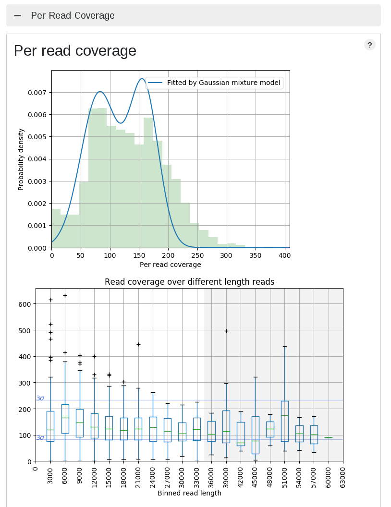
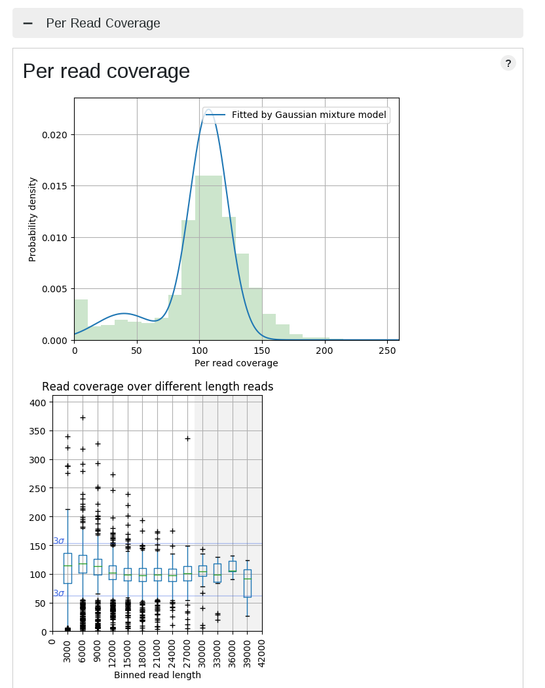
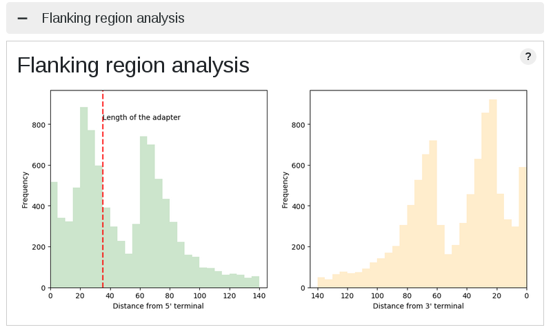
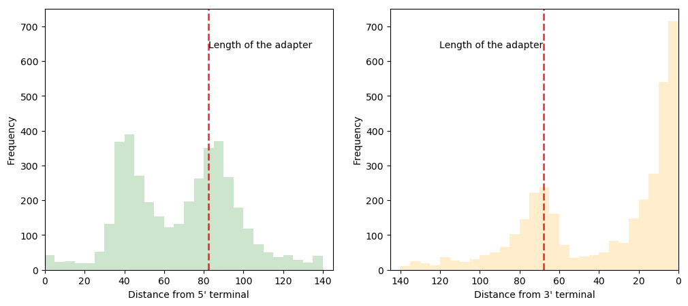
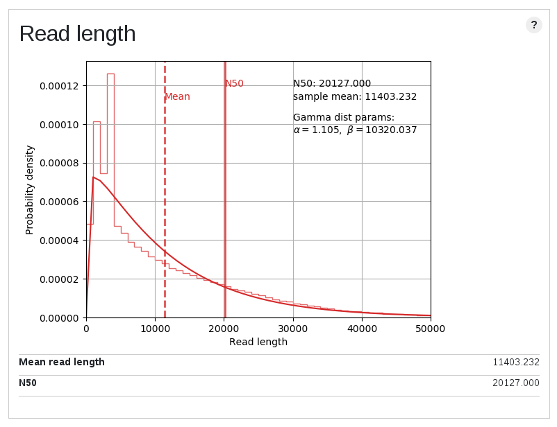
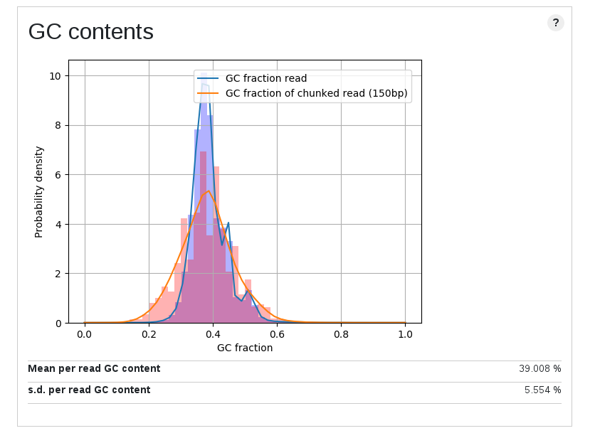
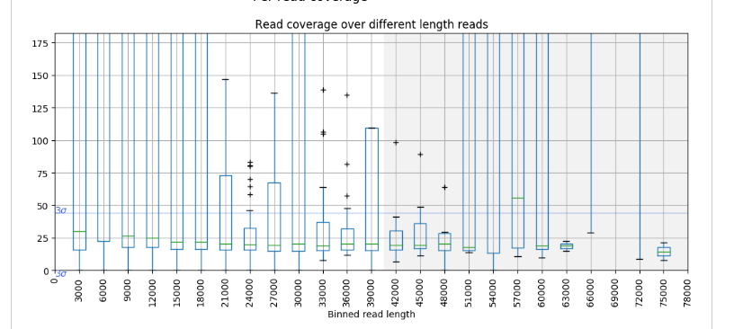

# LongQC

## What is LongQC?
LongQC is a tool for the data quality control of the PacBio and ONT long reads, and it has two functionalities: sample qc and platform qc.

**Sample QC**: this accepts standard sequence file formats, Fastq, Fasta and subread BAM from PacBio sequencers, and users can check whether their data are ready to analysis or not. You don't need any reference, meta information, even quality score.

**Platform QC**: this extracts and provides very fundamental stats for a run such as length or productivity in PacBio and some plots for productivity check in ONT.

## Why new one?
Long reads from third generation sequencers have high error rate (~15%) and quite different technological background from NGS (e.g. there is no equivalent to Illumina's cycle). In addition, base-level quality score is occasionaly [fluctuating](https://dazzlerblog.wordpress.com/2015/11/06/intrinsic-quality-values/), [too high even for noisy ones](https://github.com/amojarro/carrierseq) or completely unavailable in Sequel. Therefore, mapping back reads to references and overseeing error profile have been conducted for the QC purpose. However, this approach has dependency for the reference, which can be an inevitable issue: reference is not always available. Besides, this is typical in production lab, finding an appropriate reference is not a trivial task. If one selects very close but still wrong reference from public databases, statistics can be quite different (what you will see is the summation of evolutionary divergence and error).

LongQC was developed to overcome such situations, and it gives you a first insight of your data within a short period of time.

## Getting started
docker image is mainteined, and we recommended running LongQC on the docker. Having said that, if you want to setup manually, kidly follow below steps.

### 1. Python dependency

### Note: some of below conda packages may not be available for Python 3.8. Try other Python versions such as 3.9 or 3.7.

LongQC was written in python3 and has dependencies for popular python libraries:

* numpy
* scipy
* matplotlib (version 2.1.2 or higher)
* scikit-learn
* pandas (version 0.24.0 or higher)
* jinja2
* h5py

Also, it depends on some bioinformatics packages.

* pysam
* edlib (with its python wrapper, python-edlib)

Anaconda/miniconda should be an easier choice. We recommend [miniconda3](https://www.anaconda.com/), then install below dependency using conda.

	a) conda install h5py
	b) conda install -c bioconda pysam
	c) conda install -c bioconda edlib
	   conda install -c bioconda python-edlib

### 2. minimap2
Modified version of minimap2 named minimap2-coverage is also required. If you are a Mac user, you have to prepare libc for argp.h.

	cd /path/to/download/
	git clone https://github.com/yfukasawa/LongQC.git
	cd LongQC/minimap2-coverage && make


#### For Mac users
Argp has to be installed. Using homebrew seems to be easiest.

	brew install argp-standalone

Note: If you wish to use LongQC on an Apple Silicon ike the M1/M2 chip, you need to add some flags (i.e., arm_neon and aarch64) to make it work. Additionally, ensure that your version of LongQC is 1.2.1 or newer.

	cd /path/to/download
 	git clone https://github.com/yfukasawa/LongQC.git
  	cd LongQC/minimap2-coverage && make arm_neon=1 aarch64=1

## The Docker image
See the docker file in this repository. All of dependency will be automatically resoleved. I tested the docker image of LongQC on both Linux and Mac.
Also, many thanks for discussions and suggestions, especially for @gimnec and @grpiccoli!

### 1. Download Dockerfile
Download Dockerfile in this repository to your local space. One example is below.

	wget https://raw.githubusercontent.com/yfukasawa/LongQC/master/Dockerfile

### 2. Build

	docker build -t longqc .

In the folder you saved Dockerfile above, run the docker command to build a new container named longqc.

### 3. Run

	docker run -it \
	-v YOUR_INPUT_DIR:/input \
	-v YOUR_OUTPUT_DIR:/output \
	longqc sampleqc \
	-x pb-sequel \ **specify a preset and change accordingly.**
	-p $(nproc) \ **number of process/cores, this uses all of your cores. change accordingly.**
	-o /output/YOUR_SAMPLE_NAME \ **keep /output as this is binded.**
	/input/YOUR_INPUT_READ_FILE **keep /input as this is binded.**

Run the LongQC container built by the above command. The command will look like something above, and remove comments between double asterisks before you launch :)
The container uses `/input` and `/output` as default workspaces, and the above command mount them to YOUR_INPUT_DIR and YOUR_OUTPUT_DIR dirs in the host, respectively. These can be the same dir.
Also, change `/output/YOUR_SAMPLE_NAME` and `/input/YOUR_INPUT_READ_FILE` accordingly.

Note: on Mac OS, nproc is not available, so replace `-p $(nproc) \` by `-p $(sysctl -n hw.physicalcpu) \`. Or, simply specify number of CPU cores with an interegr (e.g. `-p 20`).

## The usage of sampleqc
#### For inpatient persons using RS-II:

	python longQC.py sampleqc -x pb-rs2 -o out_dir input_reads.(fa,fq)
#### For Sequel:

	python longQC.py sampleqc -x pb-sequel -o out_dir input_reads.bam
#### For ONT (1D ligation):

	python longQC.py sampleqc -x ont-ligation -o out_dir input_reads.fq
#### For ONT (rapid):

	python longQC.py sampleqc -x ont-rapid -o out_dir input_reads.fq

#### Required
* `input` Either fasta, fastq or PacBio BAM formatted file is required. Input file is expected to be ready for analysis or have at least 5x coverage.
* `-o` or `--output` specify a path for output
* `-x` or `--preset` specify a platform/kit to be evaluated. adapter and some ovlp parameters are automatically applied. (pb-rs2, pb-sequel, ont-ligation, ont-rapid, ont-1dsq)

#### Optional
##### General options:
* `-t` or `--transcript` applies the preset for transcripts
* `-n` or `--n_sample`
* `-s` or `--sample_name` sample name is added as a suffix for each output file.

##### Adapter options:
* `-c` or `--trim_output` path for trimmed reads. If this is not given, trimmed reads won't be saved.
* `--adapter_5` ADP5      adapter sequence for 5'.
* `--adapter_3` ADP3      adapter sequence for 3'.

##### Speed options:
* `-f` or `--fast` this turns off a sensitive setting but faster and less mem usage. Note: may not work well for a shallow coverage dataset (e.g. < 15x). 
* `-p` or `--ncpu`the number of cpus for LongQC analysis
* `-d` or `--db` make minimap2 db in parallel to other tasks.

##### Memory options:
* `-m` or `--mem` memory limit for chunking. Please specify in **gigabytes**. Default is 0.5 Gbytes. [>0 and <=2]
* `-i` or `--index` Give index size for minimap2 (-I) in **bp**. Reduce when running on a small memory machine. Default is 4G.

##### Experts:
* `--pb` sample data from PacBio sequencers. this option will be overwritten by -x.
* `--sequel` sample data from Sequel of PacBio. this option will be overwritten by -x.
* `--ont` sample data from ONT sequencers. this option will be overwritten by -x.

## Intermediate output details
LongQC generates an intermediate table (longqc_sdust.txt).
The tool automatically parses this file, but this might be useful for you either. In such a case, details for each column is below.

|Column 1|Column 2|Column 3|Column 4|Column 5|Column 6|
|---|---|---|---|---|---|
|read name|the number of bases masked (MDUST)|read length|fraction of masked bases (=coulmn2/column3)|average read QV (For Sequel CLR, N/A)|the number of bases whose QV is higher than 7 (N/A for Sequel CLR)|

## Report
Report files show traditional statistics such as length, GC content in json and html summaries. In addition, it summarizes coverage and the fraction of reads which has no coverage, we named this **non-sense reads**. If such fraction is a way high, it tells either 1) sequencing had some issues or 2) simply coverage is insufficient. 

non-sense reads: this is similar to unmappable reads; however, mappability depends on references. For example, some contaminated DNA might not be mapped to the reference you intend, and it might be called unmappable. However, these reads would be mapped to a reference of their origin if it is available. non-sense reads are kind of artifact generated by sequencers or extremely errorneous data. Therefore, conceptually they cannot be mapped to any references.

## Case study
### High coverage dispersion data
|High dispersion case|Normal dispersion case|
|---|---|
|||

This is actually not bad data, and that's why LongQC returns just warnings. The left PacBio data has a bit higher dispersion against the reference, and this is why median of depth fluctuates.

### Adapter ligation check
|Iso-seq|1D^2|
|---|---|
|||

Due to the error rate, finding adapter (barcode too) sequences is not easy in the third gen data. Coverage analysis provides an overview of artifical sequences in flanking region. ONT data show different peak for ligation, rapid, and 1d^2 kit. In general, PacBio data shows no characteristic distribution, however, Iso-seq data shows weavy plots due to primer sequences in both terminals.

### Low quality data (Ave. error rate is 25%, Q6)
It is expected that a low quality dataset has high fraction of non-sense reads. The rationale is simple: highly erroneous read cannot be mapped to any other reads. The above example is the simulated data, and in theory all of them have origins in the reference.

### Contamination of short fragment
|Length plot|GC content plot|Coverage vs length plot|
|---|---|---|
||||

These are the plots for a high quality public data. The overall stats show that this is a nice one, but as you can see plots show multimodal distributions. Although this is a genome sequencing data of a plant genome, about 10% of reads were well mapped to a *E.coli* genome. It is noteworthy they were not mapped to even organelle genomes. Short unmappable reads range from 3k to 6k, and coverage for this length shows a spike (median for this bin is out of plot area).

## The usage of platformqc
SMRT Portal, SMRT Link and some third-party tools for ONT can provide similar plots and stats. This subcommands generates equivalent stuff for users who do not have access to such servers/tools. 

## Citing LongQC
If you use LongQC in your project and cite the following publication, we'll be more than happy:

```
LongQC: A Quality Control Tool for Third Generation Sequencing Long Read Data.
Yoshinori Fukasawa, Luca Ermini, Hai Wang, Karen Carty, Ming-Sin Cheung.
G3: Genes, Genomes, Genetics, 10(4): 1193-1196, 2020
```

## Copyright and license
[minimap2](https://github.com/lh3/minimap2) was originally developed by Heng Li and licensed under MIT. [mix'EM](https://github.com/sseemayer/mixem) was developed by Stefan Seemayer and licensed under MIT. Yoshinori slightly modified their codes.
The LongQC codes are licensed under MIT.
